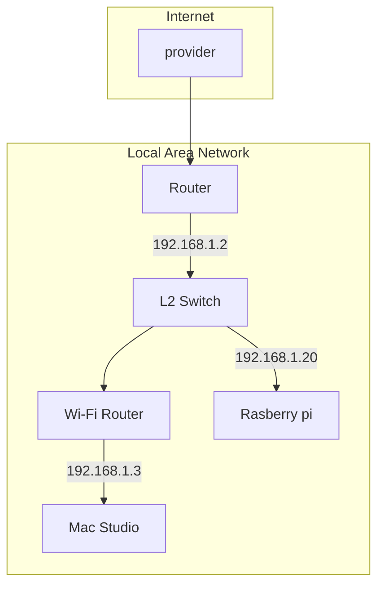

# What is this

Visualize local network traffic.  

# Expected Architecture

In my environment. 



All the network traffic is duplicated and transferred to Rasberry Pi.  
`tcpdump` runs on Rasberry Pi and Mac Studio runs this script.  


# Preparation
## Generate SSH key
For avoiding password prompting while `rsync`ing.

```sh
# on client machine.

$ ssh-keygen
Generating public/private rsa key pair.
Enter file in which to save the key (/Users/xxx/.ssh/id_rsa): /Users/xxx/.ssh/id_rsa_raspi
Enter passphrase (empty for no passphrase): 
Enter same passphrase again: 
Your identification has been saved in /Users/xxx/.ssh/id_rsa_raspi
Your public key has been saved in /Users/xxx/.ssh/id_rsa_raspi.pub
The key fingerprint is:
SHA256:x2c/ELZeKelQgsfeVYEjvJjJ4ACMUxa+LC2xONYeNcs xxx@studio.local
The key's randomart image is:
+---[RSA 3072]----+
|  +=o     .   .. |
| oo. . .   o o  .|
|  .. .oo+ + o . .|
|    B =.o*o.    .|
|   * B ES.o+o. . |
|  . + .  .+o+oo .|
|     .     o.+=..|
|            oo.+ |
|             oo  |
+----[SHA256]-----+

$ cat ~/.ssh/id_rsa_raspi.pub | pbcopy

# remote
$ vi ~/.ssh/authorized_keys

# paste public key
```

## Install Dependencies

required tools

- docker compose
- python 3

install dependencies before running.
```sh
pip3 -r requirements.txt
```

# Start to run

Run tcpdump on server

```sh
sudo tcpdump -v -n port 53 or port 80 or port 443 -G 10 -Z root -w %Y%m%d_%H%M%S.pcap
```

Run docker compose on host
```sh
docker compose up -d
```

Run shell script
```sh
sh run.sh
```